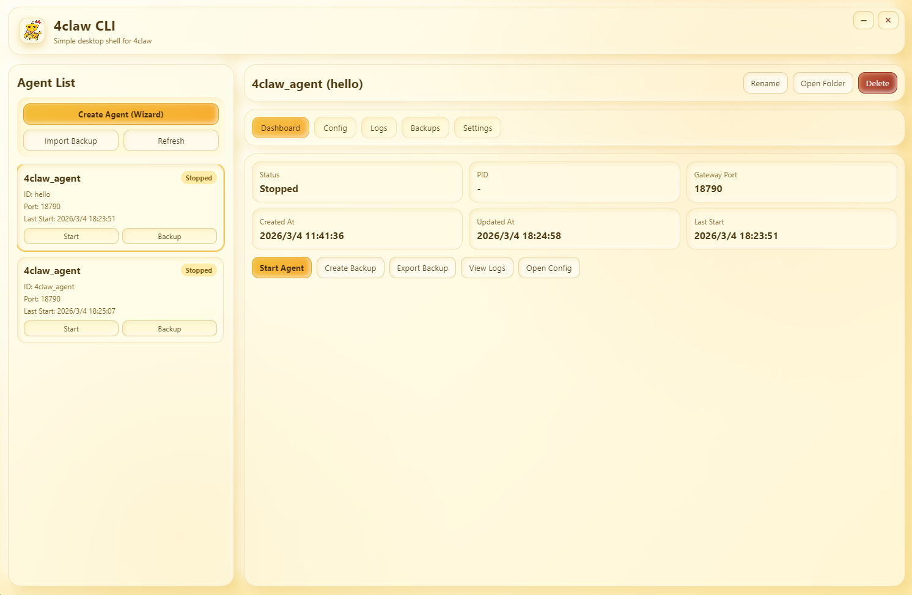

<div align="center">
  <a href="./README.md"><kbd>English (Default)</kbd></a>
  <a href="./README.zh-CN.md"><kbd>简体中文</kbd></a>
  <a href="./README.ru.md"><kbd>Русский</kbd></a>
</div>

<br />

<div align="center">
  
</div>

<div align="center">
  
</div>

# 4claw CLI Desktop

4claw CLI Desktop 是一个基于 Electron 的桌面端可视化管理工具，用来把 `4claw` 的单二进制 gateway 运行方式升级为更易用的多 Agent 运维面板。

项目目标是保留 CLI 的能力和可控性，同时提供更高效的日常操作体验：创建、启动、配置编辑、日志查看、备份管理、托盘后台运行等。

## 项目实现内容

### 1. 多 Agent 生命周期管理

- 支持多个 Agent 的创建、重命名、删除、启动、停止
- 每个 Agent 拥有独立目录与运行数据：
  - `config.json`
  - `workspace/`
  - `logs/runtime.log`
  - `meta.json`

### 2. 新建向导（Wizard）流程

- 第一步：填写 Agent 名称 + 模型信息
  - `model alias`
  - `model name`
  - `api_base`
  - `api_key`
- 第二步：填写 Telegram 信息
  - `enabled`
  - `bot token`
  - `allow_from`
- 点击 `Create & Start` 后自动完成：
  - 创建 Agent 目录与元数据
  - 写入映射后的 `config.json`
  - 自动启动 gateway 进程

### 3. 双配置编辑模式

- `Quick Config`：常用字段表单化编辑
- `Full Config`：完整递归 JSON 编辑器
- 支持配置导入 / 导出

### 4. 日志与备份能力

- 日志页 0.5 秒实时刷新（轮询）
- 支持日志清空
- 支持备份创建 / 导出 / 导入 / 恢复
- 可将历史备份恢复为新的 Agent 实例

### 5. 桌面后台运行体验

- 无边框窗口 + 自定义右上角按钮
- 关闭行为可配置：
  - 每次询问
  - 最小化到托盘
  - 直接退出
- 托盘支持：
  - 双击重新打开面板
  - 右键菜单打开面板 / 退出

### 6. 界面风格

- 亮色新拟物 + 毛玻璃风格
- 以淡黄、BSC 同款黄、橙黄为主色系
- 应用 Logo 与品牌展示统一替换

## 截图

### 主控制台



### 设置与配置页


## 技术栈

- Electron（主进程 / 预加载 / 渲染进程分层）
- HTML + CSS + Vanilla JavaScript
- Node.js 文件系统与进程管理
- `contextBridge` + `ipcRenderer.invoke` 的安全 IPC 模型
- `electron-builder` 打包（Windows / macOS）

## 架构说明

### 主进程（`src/main`）

- 窗口生命周期、托盘、关闭策略
- Agent 进程拉起与停止
- 配置、日志、备份等文件操作
- 向渲染层暴露 IPC 接口

### 预加载层（`src/preload`）

- 暴露受控 API：
  - 初始化与设置
  - Agent 管理与进程控制
  - 配置 / 日志 / 备份
  - 窗口最小化与关闭

### 渲染层（`src/renderer`）

- 多标签页桌面 UI：
  - Dashboard
  - Config（Quick / Full）
  - Logs
  - Backups
  - Settings
- 新建向导与 JSON 编辑器
- 实时日志轮询与状态同步

## 二进制放置位置

请将编译好的 4claw 二进制放到：

- `resources/bin/4claw-windows-amd64.exe`（Windows x64）
- `resources/bin/4claw-darwin-amd64`（macOS Intel）
- `resources/bin/4claw-darwin-arm64`（macOS Apple Silicon）

## 快速开始

1. 安装依赖：

```bash
npm install
```

2. 放置对应平台的 4claw 二进制到 `resources/bin/`

3. 启动开发模式：

```bash
npm run dev
```

## 构建命令

- 本地解包产物：

```bash
npm run pack
```

- Windows 安装包（NSIS）：

```bash
npm run dist:win
```

- Windows 单文件（Portable）：

```bash
npm run dist:win:portable
```

- Windows 安装包 + Portable 同时构建：

```bash
npm run dist:win:all
```

- macOS DMG：

```bash
npm run dist:mac
```

## 运行数据与备份模型

运行目录根路径：

- `<userData>/runtime/`

Agent 数据目录：

- `<userData>/runtime/agents/<agent-id>/`

备份目录：

- `<userData>/runtime/backups/`

该结构便于迁移、归档和故障恢复，你可以按 Agent 导出备份，并在其他机器或环境中导入恢复。

## 带来的便利

- 降低 CLI 日常维护操作的复杂度
- 通过向导和快速表单减少配置错误
- 通过完整 JSON 编辑器保留高级灵活性
- 通过实时日志提升问题定位效率
- 通过备份导入导出提高运维安全性
- 通过托盘后台运行保障服务连续性

## License

MIT
